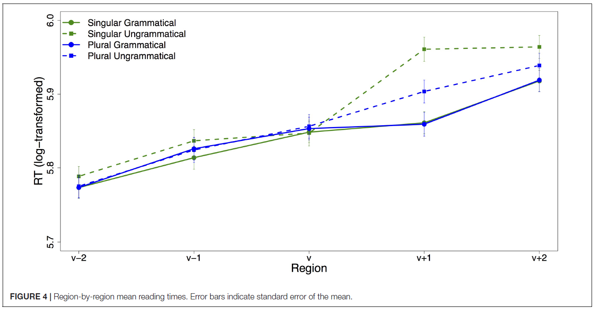
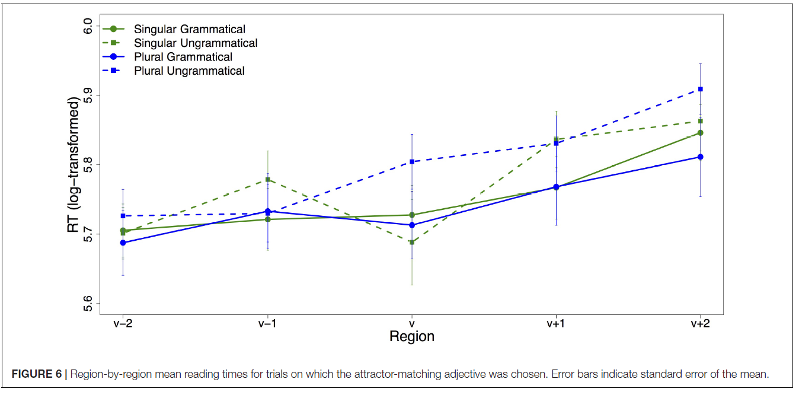

```{r setup, include=FALSE}
knitr::opts_chunk$set(echo = FALSE, warning = FALSE, cache = FALSE)
library(dplyr)
library(ggplot2)
library(knitr)

# ggplot theme
theme_set(theme_bw())
```

```{r LOAD_DATA}
filepath <- "./results.csv"
data <- read.csv(filepath, header=F, comment.char="#", col.names=paste0("V", 1:12), stringsAsFactors=F, na.strings = "NULL")
names(data)[names(data)=="V1"] <- "system_time"
names(data)[names(data)=="V2"] <- "trial"
names(data)[names(data)=="V3"] <- "controller"
names(data)[names(data)=="V4"] <- "item_num"
names(data)[names(data)=="V5"] <- "element_num"

# setting aside form and participant data
form_data <- data %>% filter(controller == "Form")
raw_data <- data %>% filter(controller == "Question" | controller == "DashedSentence")
names(raw_data)[names(raw_data)=="V6"] <- "condition"

# renaming conditions to be more human-readable
raw_data[raw_data$condition == "f", "condition"] <- "filler"
raw_data[raw_data$condition == "test_grammatical_singular", "condition"] <- "grammatical_sg"
raw_data[raw_data$condition == "test_grammatical_plural", "condition"] <- "grammatical_pl"
raw_data[raw_data$condition == "test_ungrammatical_singular", "condition"] <- "ungrammatical_sg"
raw_data[raw_data$condition == "test_ungrammatical_plural", "condition"] <- "ungrammatical_pl"

## NON-FORM DATA: first pass at formatting data
# adding stim_type column to easily categorize target and filler data
raw_data <- raw_data %>%
  mutate(stim_type = ifelse(condition == "filler",
                            "filler",
                            ifelse(condition %in% c("grammatical_sg", "grammatical_pl",
                                                    "ungrammatical_sg", "ungrammatical_pl"),
                                   "target",
                                   NA
                            )
  ))

# adding columns for grammaticality and attractor number (sg vs. pl) for categorization
raw_data <- raw_data %>%
  mutate(grammaticality = ifelse(condition %in% c("grammatical_sg", "grammatical_pl"),
                                 "grammatical",
                                 ifelse(condition %in% c("ungrammatical_sg", "ungrammatical_pl"),
                                        "ungrammatical",
                                        NA)
  )
  ) %>%
  mutate(attractor = ifelse(condition %in% c("grammatical_sg", "ungrammatical_sg"),
                            "singular",
                            ifelse(condition %in% c("grammatical_pl", "ungrammatical_pl"),
                                   "plural",
                                   NA)
  ))

## QUESTION DATA
# formatting column names for two types of data
# first type: question
question_data <- raw_data %>% filter(controller == "Question" & condition != "practice")
names(question_data)[names(question_data)=="V8"] <- "question"
names(question_data)[names(question_data)=="V9"] <- "answer"
names(question_data)[names(question_data)=="V10"] <- "accuracy"
names(question_data)[names(question_data)=="V11"] <- "response_time"

# fixing data types
question_data <- question_data %>%
  mutate(accuracy = as.integer(accuracy)) %>%
  mutate(response_time = as.integer(response_time))

# adding columns for human-readable (string) and numerical (for calculations) accuracy
question_data <- question_data %>%
  mutate(accuracy_numeric = as.integer(accuracy)) %>%
  mutate(accuracy_label = ifelse(accuracy == 1, "correct", "false"))

## READING DATA
# second type: dashed sentence
reading_data <- raw_data %>% filter(controller == "DashedSentence" & condition != "practice")
names(reading_data)[names(reading_data)=="V8"] <- "word_num"
names(reading_data)[names(reading_data)=="V9"] <- "word"
names(reading_data)[names(reading_data)=="V10"] <- "RT"
names(reading_data)[names(reading_data)=="V11"] <- "newline"
names(reading_data)[names(reading_data)=="V12"] <- "sentence"

# fixing data types
reading_data <- reading_data %>%
  mutate(RT = as.integer(RT))

# joining the question and reading dataframes
# each row now marked for accuracy
# skipping duplicated columns (V1-thru-V7 except for merge pivots)

# using all columns from question data
question_columns <- question_data[, -3] # all cols but controller (since we're merging data with two different values)

# using non-duplicate columns for reading data (+ pivot columns)
reading_columns <- reading_data[, c("trial", "item_num", "word_num", "word", "RT", "newline", "sentence")]

total_data <- merge(question_columns, reading_columns)
```

## Schlueter et al. (2019): Overview

- Agreement attraction
- 'The <span style="color: red;">key</span> to the <span style="color: blue;">cabinets</span> **<span style="color: blue;">were</span>** rusty.'
- Why don't these sentences incur processing difficulty?
- Facilitation in memory architecture based on cue-based retrieval
- Highly debated topic in the psycholinguistics literature (Wagers et al. 2009, Dillon et al. 2013)

## Schlueter et al. (2019): Background

- Wagers et al (2009): agreement attraction effect reflects an error-prone cue-based retrieval mechanism
- Rechecking triggered by encountering agreement error on the verb
- Effect occurs when the attractor's activation level in memory is higher than the subject's

## Schlueter et al. (2019): Questions

- What is the structural representation of the input?
- Recall that final representations are not always consistent with the input (garden paths, implausible sentences)
- Is the attractor being reanalyzed as the subject?

## Schlueter et al. (2019): Questions

- Structural reanalysis or low-level rechecking?
- Reanalysis would mean excluding some of the input from the representation
- Rechecking would mean the final representation contains an agreement violation

## Schlueter et al. (2019): Methodology

- Self-paced reading with speeded forced choice task
- 4x4 design: attractor number (sg, pl) x verb agreement (sg, pl)
- ex: 'The <span style="color: red;">bed</span> by the <span style="color: blue;">lamp</span> was/were undoubtedly quite: <span style="color: red;">comfortable</span> / <span style="color: blue;">bright</span>
- Choice of head-matching adjective → rechecking
- Choice of attractor-matching adjective → reanalysis

## Schlueter et al. (2019): Results

- Participants chose the attractor-matching adjective more often in the *ungrammatical plural* condition, but still very infrequently
- ex: 'The <span style="color: red;">glass</span> behind the <span style="color: blue;">curtains</span> **were** most definitely: <span style="color: blue;">tattered</span> / <span style="color: red;">shattered</span>' → **<span style="color: blue;">tattered</span>**
- RT data showed agreement attraction effect even when the head-matching adjective was chosen
- Results suggest that structural reanalysis only happens rarely

## Schlueter et al. (2019): RT

```{r}

```


## Schlueter et al. (2019): head-matching choice RT

```{r}

```

## Schlueter et al. (2019): attractor-matching choice RT

```{r}

```

## Replication Study

- Platform: Ibex Farm
- `r length(unique(total_data$trial))` participants
- 48 experimental items and 48 fillers
- self-paced reading task + forced choice sentence completion
- Full procedure took approximately 10 minutes

## Data Summary | Adjective choice accuracy

```{r}
plot_data <- question_data

plot_data %>%
  # group_by(condition) %>%
  group_by(condition, stim_type, grammaticality, attractor) %>%
  summarize(n = n(),
            n_correct = sum(accuracy_numeric),
            accuracy = sprintf("%.2f%%", 100 * mean(accuracy_numeric)),
            stdev = sprintf("%.4f", sd(accuracy_numeric)),
  ) %>%
  kable(align = c('l','l','l','l','c','c','c','c'))
```

## Data Summary | Adjective choice accuracy: fillers vs. targets

```{r}
plot_data <- question_data

ggplot(plot_data, aes(x="", y=accuracy_numeric)) + 
  geom_violin(aes(fill = stim_type)) +
  ylab("adjective choice accuracy") +
  xlab("stimuli type") +
  facet_grid(~stim_type, switch = 'x') +
  ggtitle("Adjective choice accuracy in fillers vs. targets") +
  theme(legend.position="none")
```

## Data Summary | Adjective choice accuracy by condition

```{r}
plot_data <- question_data

ggplot(plot_data, aes(x="", y=accuracy_numeric)) + 
  geom_violin(aes(fill = stim_type)) +
  # geom_boxplot() +
  # stat_summary(fun=mean, geom="point", shape=2, size=2) +
  ylab("adjective choice accuracy") +
  xlab("condition") +
  facet_grid(~condition, switch = 'x') +
  ggtitle("Adjective choice accuracy by condition") +
  theme(legend.position="none")
```

## Data Summary | Adjective choice accuracy by condition

```{r}
plot_data <- question_data %>%
  filter(stim_type == "target")

ggplot(plot_data, aes(x="", y=accuracy_numeric)) + 
  geom_violin(aes(fill = condition)) +
  # geom_boxplot() +
  # stat_summary(fun=mean, geom="point", shape=2, size=2) +
  ylab("adjective choice accuracy") +
  xlab("condition") +
  facet_grid(attractor~grammaticality, switch = 'x') +
  ggtitle("Adjective choice accuracy by condition")
```

## Data Summary | Adjective choice accuracy by condition

```{r}
plot_data <- question_data %>%
  filter(stim_type == "target") %>%
  mutate(head_matching = as.factor(ifelse(accuracy_label == "correct", "head-matching", "attractor-matching")))

ggplot(plot_data, aes(x=head_matching, fill=head_matching)) + 
  geom_bar(color="black") +
  facet_grid(attractor~grammaticality) +
  theme(legend.position="none") +
  xlab("adjective choice")
  # facet_grid(attractor~grammaticality, switch = 'x') +
  # ggtitle("Adjective choice accuracy by condition")
```

## Data Summary | Verb RTs

```{r verb_RT}
plot_data <- total_data %>%
  filter(word == "was" | word == "were") %>%
  filter(!is.na(stim_type))

plot_data %>%
  # group_by(condition) %>%
  group_by(condition, stim_type, grammaticality, attractor) %>%
  summarize(n = n(),
            mean_RT = sprintf("%.2f", mean(RT)),
            stdev_RT = sprintf("%.2f", sd(RT)),
            mean_logRT =sprintf("%.2f",  mean(log(RT))),
            stdev_logRT = sprintf("%.2f", sd(log(RT)))
  ) %>%
  kable(align = c('l','l','l','l','c','c','c','c','c'))
```

<!-- ## Data Summary | RTs by condition -->

<!-- ```{r} -->
<!-- plot_data <- total_data %>% -->
<!--   filter(word == "was" | word == "were") %>% -->
<!--   filter(!is.na(stim_type)) -->

<!-- ggplot(plot_data, aes(x="", y=RT)) +  -->
<!--   geom_violin(aes(fill=stim_type)) + -->
<!--   # stat_summary(fun=mean, geom="point", shape=2, size=2) + -->
<!--   ylab("verb RT (ms)") + -->
<!--   xlab("condition") + -->
<!--   facet_grid(~condition, switch = 'x') + -->
<!--   ggtitle("Verb Reading Time by condition") -->
<!-- ``` -->

## Data Summary | Verb RTs by condition

```{r}
plot_data <- total_data %>%
  filter(word == "was" | word == "were") %>%
  filter(!is.na(stim_type))%>%
  mutate(log_RT = log(RT))

ggplot(plot_data, aes(x="", y=log_RT)) + 
  geom_violin(aes(fill=stim_type)) +
  # stat_summary(fun=mean, geom="point", shape=2, size=2) +
  ylab("verb log(RT)") +
  xlab("condition") +
  facet_grid(~condition, switch = 'x') +
  ggtitle("Verb Reading Time by condition")
```


<!-- ## Data Summary | RTs by region -->

<!-- ```{r} -->
<!-- plot_data <- reading_data %>% -->
<!--   filter(stim_type == "target") %>% -->
<!--   filter(word_num < 8) %>% # cuts 1 word after verb bc. sentences are of different lengths -->
<!--   mutate(log_RT = log(RT)) %>% -->
<!--   group_by(word_num, condition) %>% -->
<!--   mutate(mean_RT = mean(RT)) %>% -->
<!--   mutate(stdev_RT = sd(RT)) %>% -->
<!--   mutate(lo_RT = mean_RT - stdev_RT) %>% -->
<!--   mutate(hi_RT = mean_RT + stdev_RT) %>% -->
<!--   mutate(mean_log_RT = mean(log_RT)) %>% -->
<!--   mutate(stdev_log_RT = sd(log_RT)) %>% -->
<!--   mutate(lo_log_RT = mean_log_RT - stdev_log_RT) %>% -->
<!--   mutate(hi_log_RT = mean_log_RT + stdev_log_RT) %>% -->
<!--   ungroup() -->

<!-- ## overall RTs -->
<!-- plot_data$word_num <- as.integer(plot_data$word_num) -->
<!-- ggplot(plot_data, aes(x=word_num, y=mean_RT, color=condition)) + -->
<!--   geom_line() + -->
<!--   geom_point(size=2) + -->
<!--   # geom_errorbar(aes(ymin = lo_RT, ymax = hi_RT)) + -->
<!--   # geom_jitter() -->
<!--   scale_x_continuous(breaks = seq(0,9)) + -->
<!--   ggtitle("Word-by-word mean reading times") -->
<!-- ``` -->

<!-- - Verb @ position 6 -->

## Data Summary | RTs by region

```{r}
plot_data <- reading_data %>%
  filter(stim_type == "target") %>%
  filter(word_num < 8) %>% # cuts 1 word after verb bc. sentences are of different lengths
  mutate(log_RT = log(RT)) %>%
  group_by(word_num, condition) %>%
  # mutate(mean_RT = mean(RT)) %>%
  # mutate(stdev_RT = sd(RT)) %>%
  # mutate(lo_RT = mean_RT - stdev_RT) %>%
  # mutate(hi_RT = mean_RT + stdev_RT) %>%
  mutate(mean_log_RT = mean(log_RT)) %>%
  mutate(stdev_log_RT = sd(log_RT)) %>%
  mutate(lo_log_RT = mean_log_RT - stdev_log_RT) %>%
  mutate(hi_log_RT = mean_log_RT + stdev_log_RT) %>%
  ungroup()

## overall RTs
plot_data$word_num <- as.integer(plot_data$word_num)
ggplot(plot_data, aes(x=word_num, y=mean_log_RT, color=condition)) +
  geom_line() +
  geom_point(size=2) +
  # geom_errorbar(aes(ymin = lo_log_RT, ymax = hi_log_RT)) +
  # geom_jitter()
  scale_x_continuous(breaks = seq(0,9)) +
  ylab("mean log(RT)") +
  ggtitle("Word-by-word mean Reading Times")
```

<!-- ## Data Summary | RTs by region: with variation -->

<!-- ```{r} -->
<!-- plot_data <- reading_data %>% -->
<!--   filter(stim_type == "target") %>% -->
<!--   filter(word_num < 8) %>% # cuts 1 word after verb bc. sentences are of different lengths -->
<!--   mutate(log_RT = log(RT)) %>% -->
<!--   group_by(word_num, condition) %>% -->
<!--   mutate(mean_RT = mean(RT)) %>% -->
<!--   mutate(stdev_RT = sd(RT)) %>% -->
<!--   mutate(lo_RT = mean_RT - stdev_RT) %>% -->
<!--   mutate(hi_RT = mean_RT + stdev_RT) %>% -->
<!--   # mutate(mean_log_RT = mean(log_RT)) %>% -->
<!--   # mutate(stdev_log_RT = sd(log_RT)) %>% -->
<!--   # mutate(lo_log_RT = mean_log_RT - stdev_log_RT) %>% -->
<!--   # mutate(hi_log_RT = mean_log_RT + stdev_log_RT) %>% -->
<!--   ungroup() -->

<!-- ## overall RTs -->
<!-- plot_data$word_num <- as.integer(plot_data$word_num) -->
<!-- ggplot(plot_data, aes(x=word_num, y=mean_RT, color=condition)) + -->
<!--   geom_line() + -->
<!--   geom_point(size=2) + -->
<!--   geom_errorbar(aes(ymin = lo_RT, ymax = hi_RT)) + -->
<!--   # geom_jitter() -->
<!--   scale_x_continuous(breaks = seq(0,9)) + -->
<!--   ggtitle("Word-by-word mean reading times") -->
<!-- ``` -->

## Data Summary | RTs by region: with variation

```{r}
plot_data <- reading_data %>%
  filter(stim_type == "target") %>%
  filter(word_num < 8) %>% # cuts 1 word after verb bc. sentences are of different lengths
  mutate(log_RT = log(RT)) %>%
  group_by(word_num, condition) %>%
  # mutate(mean_RT = mean(RT)) %>%
  # mutate(stdev_RT = sd(RT)) %>%
  # mutate(lo_RT = mean_RT - stdev_RT) %>%
  # mutate(hi_RT = mean_RT + stdev_RT) %>%
  mutate(mean_log_RT = mean(log_RT)) %>%
  mutate(stdev_log_RT = sd(log_RT)) %>%
  mutate(lo_log_RT = mean_log_RT - stdev_log_RT) %>%
  mutate(hi_log_RT = mean_log_RT + stdev_log_RT) %>%
  ungroup() %>%
  mutate(word_num = as.integer(word_num))

ggplot(plot_data, aes(x=word_num, y=mean_log_RT, color=condition)) +
  geom_line() +
  geom_point(size=2) +
  geom_errorbar(aes(ymin = lo_log_RT, ymax = hi_log_RT)) +
  # geom_jitter()
  scale_x_continuous(breaks = seq(0,9)) +
  ylab("mean log(RT)") +
  ggtitle("Word-by-word Reading Time")
```

<!-- ## Data Summary | RTs split by condition -->

<!-- ```{r} -->
<!-- ## overall RTs -->
<!-- plot_data$word_num <- as.integer(plot_data$word_num) -->
<!-- ggplot(plot_data, aes(x=word_num, y=mean_RT, color=condition)) + -->
<!--   geom_line() + -->
<!--   geom_point(size=2) + -->
<!--   geom_errorbar(aes(ymin = lo_RT, ymax = hi_RT)) + -->
<!--   # geom_jitter() -->
<!--   scale_x_continuous(breaks = seq(0,9)) + -->
<!--   facet_grid(attractor~grammaticality, scales = "free_y") + -->
<!--   ggtitle("Word-by-word mean reading times") -->
<!-- ``` -->

## Data Summary | RT split by factors

```{r}
plot_data <- reading_data %>%
  filter(stim_type == "target") %>%
  filter(word_num < 8) %>% # cuts 1 word after verb bc. sentences are of different lengths
  mutate(log_RT = log(RT)) %>%
  group_by(word_num, grammaticality, attractor) %>%
  # mutate(mean_RT = mean(RT)) %>%
  # mutate(stdev_RT = sd(RT)) %>%
  # mutate(lo_RT = mean_RT - stdev_RT) %>%
  # mutate(hi_RT = mean_RT + stdev_RT) %>%
  mutate(mean_log_RT = mean(log_RT)) %>%
  mutate(stdev_log_RT = sd(log_RT)) %>%
  mutate(lo_log_RT = mean_log_RT - stdev_log_RT) %>%
  mutate(hi_log_RT = mean_log_RT + stdev_log_RT) %>%
  ungroup() %>%
  mutate(word_num = as.integer(word_num))

## overall RTs
plot_data$word_num <- as.integer(plot_data$word_num)
ggplot(plot_data, aes(x=word_num, y=mean_log_RT, color=condition)) +
  geom_line() +
  geom_point(size=2) +
  geom_errorbar(aes(ymin = lo_log_RT, ymax = hi_log_RT)) +
  # geom_jitter()
  scale_x_continuous(breaks = seq(0,9)) +
  facet_grid(attractor~grammaticality, scales = "free_y") +
  ggtitle("Word-by-word mean reading times")
```

## Extra Data | RTs by adjective choice

```{r}
plot_data <- total_data %>%
  filter(stim_type == "target") %>%
  filter(word_num < 8) %>% # cuts 1 word after verb bc. sentences are of different lengths
  mutate(log_RT = log(RT)) %>%
  group_by(word_num, grammaticality, attractor, accuracy) %>%
  # mutate(mean_RT = mean(RT)) %>%
  # mutate(stdev_RT = sd(RT)) %>%
  # mutate(lo_RT = mean_RT - stdev_RT) %>%
  # mutate(hi_RT = mean_RT + stdev_RT) %>%
  mutate(mean_log_RT = mean(log_RT)) %>%
  mutate(stdev_log_RT = sd(log_RT)) %>%
  mutate(lo_log_RT = mean_log_RT - stdev_log_RT) %>%
  mutate(hi_log_RT = mean_log_RT + stdev_log_RT) %>%
  ungroup() %>%
  mutate(word_num = as.integer(word_num))

## RTs by accuracy
plot_data$word_num <- as.integer(plot_data$word_num)
ggplot(plot_data, aes(x=word_num, y=mean_log_RT, color=accuracy_label)) +
  geom_line() +
  geom_point(size=2) +
  # geom_errorbar(aes(ymin = lo_log_RT, ymax = hi_log_RT)) +
  # geom_jitter()
  scale_x_continuous(breaks = seq(0,9)) +
  facet_grid(attractor~grammaticality, scales = "free_y") +
  ggtitle("Word-by-word mean reading times")
```


## Extra Data | RTs by adjective choice with variation

```{r}
plot_data <- total_data %>%
  filter(stim_type == "target") %>%
  filter(word_num < 8) %>% # cuts 1 word after verb bc. sentences are of different lengths
  mutate(log_RT = log(RT)) %>%
  group_by(word_num, grammaticality, attractor, accuracy) %>%
  # mutate(mean_RT = mean(RT)) %>%
  # mutate(stdev_RT = sd(RT)) %>%
  # mutate(lo_RT = mean_RT - stdev_RT) %>%
  # mutate(hi_RT = mean_RT + stdev_RT) %>%
  mutate(mean_log_RT = mean(log_RT)) %>%
  mutate(stdev_log_RT = sd(log_RT)) %>%
  mutate(lo_log_RT = mean_log_RT - stdev_log_RT) %>%
  mutate(hi_log_RT = mean_log_RT + stdev_log_RT) %>%
  ungroup() %>%
  mutate(word_num = as.integer(word_num))

## RTs by accuracy
plot_data$word_num <- as.integer(plot_data$word_num)
ggplot(plot_data, aes(x=word_num, y=mean_log_RT, color=accuracy_label)) +
  geom_line() +
  geom_point(size=2) +
  geom_errorbar(aes(ymin = lo_log_RT, ymax = hi_log_RT)) +
  # geom_jitter()
  scale_x_continuous(breaks = seq(0,9)) +
  facet_grid(attractor~grammaticality, scales = "free_y") +
  ggtitle("Word-by-word mean reading times")
```

## Results: Overall

- Agreement attraction condition did not trigger more attractor-matching adjective choices
- Agreement attraction condition exhibited the highest RTs on the verb and spillover region, but also the most variation
- Inconclusive results overall

## Conclusion

- Thank you!
- Any questions?

## References

Dillon, B., Mishler, A., Sloggett, S., and Phillips, C. (2013). Contrasting intrusion profiles for agreement and anaphora: experimental and modeling evidence. *Journal of Memory and Language*, 36, 147. 

Schlueter, Z., Parker, D., & Lau, E. (2019). Error-driven Retrieval in Agreement Attraction rarely leads to Misinterpretation. *Frontiers in psychology*, 10, 1002.

Wagers, M.W., Lau, E.F., and Phillips, C. (2009). Agreement attraction in comprehension: representations and processes. *Journal of Memory and Language*, 49, 285.
